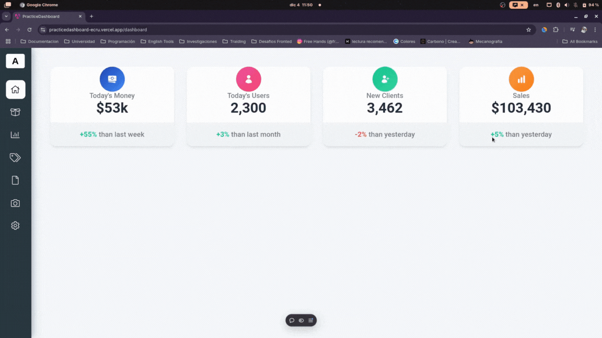

## PracticeDashboard 🌟
A powerful and flexible dashboard application built with Angular CLI version 18.1.4. This project is designed to provide developers with a clean and efficient starting point for creating dashboards and applications.

## Features 🚀
Live Reload: Seamlessly update your application during development.
Code Scaffolding: Quickly generate components, directives, and more.
Angular CLI Integration: Leverage Angular's CLI for smooth development and building workflows.

Screenshot of the dashboard interface.

To include a video demo, create a .gif version of your demo and embed it here:

## Development server
Run ng serve for a dev server. Navigate to http://localhost:4200/. The application will automatically reload if you change any of the source files.

 
## Development Setup 🛠️
Start the Development Server
`ng serve -o`

## Code scaffolding

Run `ng generate component component-name` to generate a new component. You can also use `ng generate directive|pipe|service|class|guard|interface|enum|module`.

## Build

Run `ng build` to build the project. The build artifacts will be stored in the `dist/` directory.

## Running unit tests

Run `ng test` to execute the unit tests via [Karma](https://karma-runner.github.io).

## Running end-to-end tests

Run `ng e2e` to execute the end-to-end tests via a platform of your choice. To use this command, you need to first add a package that implements end-to-end testing capabilities.

## Further help

To get more help on the Angular CLI use `ng help` or go check out the [Angular CLI Overview and Command Reference](https://angular.dev/tools/cli) page.
